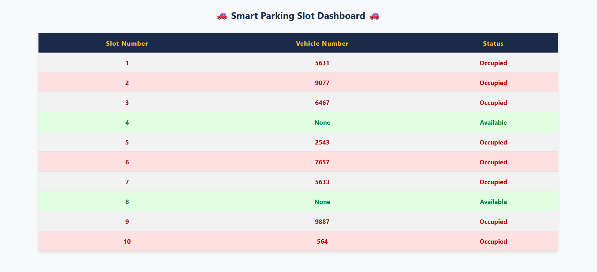

# Smart Parking Simulator

A real-time Smart Parking System built using C, with a live dashboard powered by HTML, CSS, and JavaScript.

This project simulates the behavior of a smart parking lot, automatically updating a dashboard showing slot occupancy. It’s a lightweight simulation intended for learning, demonstration, and academic projects.

---

## Project Overview

This simulator:
- Tracks parking slot availability
- Assigns/revokes slots dynamically as cars enter/exit
- Generates a JSON output file in real-time
- Renders a neat dashboard in the browser to display status

---

## Features

- Written in **C** (core logic)
- Outputs real-time data to **JSON**
- Live dashboard rendered using **HTML/CSS/JS**
- Neat, responsive, and auto-refreshing UI
- User doesn’t need to refresh — updates every 1.5 seconds
- Works on all modern browsers

---

## Dashboard Preview

The current state of the parking lot is rendered like this:



> Each slot shows its number, vehicle number (if occupied), and live status.

---

## How to Use

### Requirements
- GCC (e.g., [TDM-GCC](https://jmeubank.github.io/tdm-gcc/)) for compiling the C program
- A browser like Chrome or Edge

### Compilation
```bash
gcc smart_parking.c -o parking_sim
